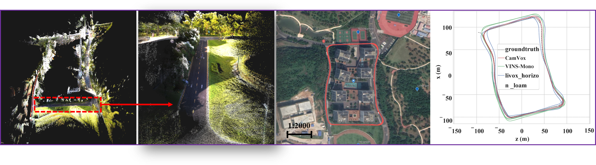

# CamVox
## A Low-cost and Accurate Lidar-assisted Visual SLAM System
We propose **CamVox** by adapting Livox lidars into visual SLAM (ORBSLAM2) by exploring the lidars’ unique features. Based on the non-repeating nature of Livox lidars, we propose an automatic lidar-camera calibration method that will work in uncontrolled scenes. The long depth detection range also benefit a more efficient mapping. Comparison of CamVox with visual SLAM (VINS-mono) and lidar SLAM (LOAM) are evaluated on the same dataset to demonstrate the performance.

<div align="center">
    
</div>

**Developer:** [Yuewen Zhu](https://github.com/zywok), [Chunran Zheng](https://github.com/xuankuzcr)

**Our related video**: our related videos are now available on [[YouTube Video](https://www.youtube.com)] [[bilibili Video](https://www.bilibili.com)]. 

## 1. Prerequisites
### 1.1 Ubuntu and ROS
Ubuntu 64-bit 16.04 or 18.04.
ROS Kinetic or Melodic. [ROS Installation](http://wiki.ros.org/ROS/Installation)

### 1.2 Pangolin
We use [Pangolin](https://github.com/stevenlovegrove/Pangolin) for visualization and user interface. Dowload and install instructions can be found at: https://github.com/stevenlovegrove/Pangolin.

### 1.3 OpenCV
We use [OpenCV](http://opencv.org) to manipulate images and features. Dowload and install instructions can be found at: http://opencv.org. **Required at leat 2.4.3. Tested with OpenCV 2.4.11 and OpenCV 3.2**.

### 1.4 Eigen3
Download and install instructions can be found at: http://eigen.tuxfamily.org. **Required at least 3.1.0**.

### 1.6 Ceres Solver
Follow [Ceres Installation](http://ceres-solver.org/installation.html).

## 2. Build CamVox
Clone the repository and catkin_make:

```
    cd ~/catkin_ws/src
    git clone https://github.com/ISEE-Technology/CamVox
    cd ../
    catkin_make
    source ~/catkin_ws/devel/setup.bash
```
## 3. Run with Hardware
### 3.1 Hardware
| Item  | Pics  | Shopping link |
| :------------: | :------------: | :------------: |
| Livox Horizon  |   | [DJI](https://store.dji.com/cn/product/livox-mid?vid=48991) |
| MV-CE060-10UC  |   | [DJI](https://store.dji.com/cn/product/livox-mid?vid=48991) |
| UGV Chassis  |   | [Link](https://www.robomaster.com/zh-CN/products/components/detail/1839)
| Livox Hub (**optional**)  |   | [DJI](https://store.dji.com/zh-tw/product/livox-hub) |

### 3.2 Hard Synchronization


### 3.3 Running

Connect to your PC to Livox Horizon lidar by following  [Livox-ros-driver installation](https://github.com/Livox-SDK/livox_ros_driver).

```
    roslaunch CamVox CamVox_test.launch
    roslaunch MVS MVS.launch
    roslaunch livox_ros_driver livox_lidar.launch
```


## 4. Run with Rosbag Example

### 4.1 SUSTech Dataset (Loop Closure)
We open sourced our dataset in SUSTech campus with loop closure. [Download here](https://drive.google.com/file/)
### 4.2 Rosbag Example with static scenes (Automatic Calibration trigger)
We provide a rosbag file with static scenes to test the automatic calibration thread. [Download here](https://drive.google.com/file/)
### 4.3 Running
```
    roslaunch CamVox CamVox_test.launch
    roslaunch MVS MVS.launch
    rosbag play YOUR_DOWNLOADED.bag
```

## 5. Acknowledgements
The authors thank colleagues at Livox Technology for helpful discussion and support. <br/>
The repository is from [**ISEE**](https://isee.technology/).

## 6. License

The source code is released under [GPLv2](http://www.gnu.org/licenses/) license.

